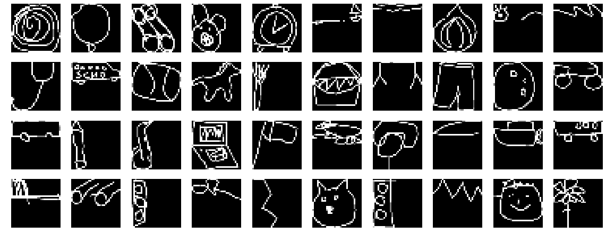
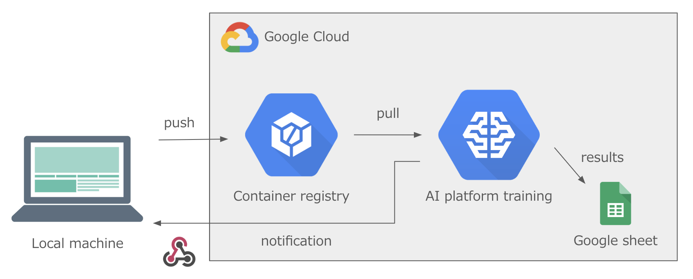

## Slide
https://www.slideshare.net/RyuichiKanoh/practical-tips-for-handling-noisy-data-and-annotaiton-204194127

## Experiment Overview

- Image classification with 340 labels.
- Evaluation metric is top-1 accuracy.
- QuickDraw dataset [(Link)](https://www.kaggle.com/c/quickdraw-doodle-recognition) is used. 
  - Timestamped vectors are converted to 1ch images with 32x32 resolution.
  - Dataset is randomly subsampled.

<p align="center">
    
</p>

## Setup
<p align="center">
    
</p>

- You need to modify `./invoke.yaml` and `./project/work/settings.yaml`.
- For using spreadsheet api, you need to put credential json in `./project/work/reporter/*.json`.
[(Reference)](https://towardsdatascience.com/accessing-google-spreadsheet-data-using-python-90a5bc214fd2)

## Local requirements

- docker (with GPU support)
- invoke

## Commands

Almost all commands are executed by invoke (http://www.pyinvoke.org/). Command details are defined in `tasks.py`.

### ---Local---

#### Build docker image
```
inv build-local
```

#### Start container

```
inv run-local
```

#### Attach
```
inv attach-local
```

#### Stop
```
inv stop-local
```

For removing unused container or image, use `docker container prune` `docker image prune`

### ---AI Platform Training---

#### push to gcr
```
inv push-remote
```

#### train
```
inv train-ai-platform --batch-size 128 --learning-rate 1e-2
```

### ---Others---

#### prepare input dataset from original kaggle dataset

```
cd project/data_preparation
python quickdraw.py
```
You need to put kaggle original dataset in `quickdraw_original` folder.

```
data_preparation
├── quickdraw.py
└── quickdraw_original
    ├── sample_submission.csv
    ├── test_raw.csv
    ├── test_simplified.csv
    ├── train_raw [340 entries]
    └── train_simplified [340 entries]
```

## Overview
```
.
├── README.md
├── ai_platform.py
├── fig
│   ├── env.png
│   └── image_sample.png
├── image
│   ├── local
│   │   └── Dockerfile
│   └── remote
│       └── Dockerfile
├── invoke.yaml
├── make_command.py
├── project
│   ├── data_preparation
│   │   ├── quickdraw.py
│   │   └── quickdraw_original
│   ├── input
│   │   └── quickdraw
│   │       ├── label_name.csv
│   │       ├── test_images.pkl.gz
│   │       ├── test_labels.pkl.gz
│   │       ├── train_images.pkl.gz
│   │       └── train_labels.pkl.gz
│   ├── notebook
│   ├── output
│   └── work
│       ├── common.py
│       ├── dataset
│       │   ├── base_dataset.py
│       │   └── distillation_dataset.py
│       ├── main.py
│       ├── model.py
│       ├── reporter
│       │   ├── put_credential_json_here.txt
│       │   └── reporter.py
│       ├── runner
│       │   ├── base_runner.py
│       │   ├── distillation_runner.py
│       │   └── mixup_runner.py
│       └── settings.yaml
├── requirements.txt
└── tasks.py

```
